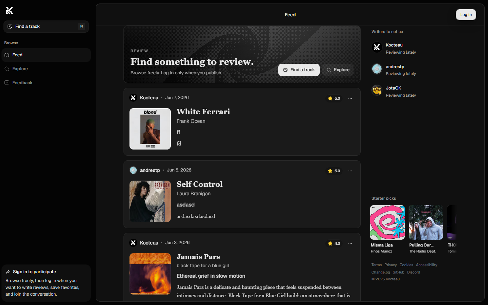

<p align="center">
  
</p>

<h1 align="center">Kocteau</h1>

<p align="center">
  Music reviews by real listeners. Human taste, quiet discovery, and editorial starter picks.
</p>

<p align="center">
  <a href="./LICENSE"></a>
  <a href="https://nextjs.org"></a>
  <a href="https://supabase.com"></a>
  
  <a href="https://github.com/francozeta/kocteau/graphs/contributors"></a>
  <a href="https://github.com/francozeta/kocteau/issues?q=is%3Aissue%20state%3Aopen%20label%3A%22good%20first%20issue%22"></a>
</p>

<p align="center">
  <a href="https://kocteau.com">Website</a>
  ·
  <a href="./CONTRIBUTING.md">Contributing</a>
  ·
  <a href="./docs/backlog.md">Backlog</a>
  ·
  <a href="https://github.com/francozeta/kocteau/issues?q=is%3Aissue%20state%3Aopen%20label%3A%22good%20first%20issue%22">Good first issues</a>
  ·
  <a href="./docs/README.md">Docs</a>
</p>

<p align="center">
  
</p>

Kocteau is an open-source music review and taste discovery app. The current product loop is simple: enter with email OTP, complete a profile, choose initial taste signals, review music, and discover new reviews through a personalized For You feed.

## Start Here

| If you want to... | Go here |
| --- | --- |
| Try the app | [kocteau.com](https://kocteau.com) |
| Make a first contribution | [Good first issues](https://github.com/francozeta/kocteau/issues?q=is%3Aissue%20state%3Aopen%20label%3A%22good%20first%20issue%22) |
| Understand the product direction | [docs/web-roadmap.md](./docs/web-roadmap.md) |
| Read the contributor guide | [CONTRIBUTING.md](./CONTRIBUTING.md) |
| Browse the public backlog | [docs/backlog.md](./docs/backlog.md) |

## First Contribution Path

Good first PRs are usually docs, copy, accessibility, empty states, loading states, or small web UI polish.

1. Pick a scoped issue from [good first issues](https://github.com/francozeta/kocteau/issues?q=is%3Aissue%20state%3Aopen%20label%3A%22good%20first%20issue%22) or [help wanted](https://github.com/francozeta/kocteau/issues?q=is%3Aissue%20state%3Aopen%20label%3A%22help%20wanted%22).
2. Read [CONTRIBUTING.md](./CONTRIBUTING.md).
3. Run the local web app with the local Supabase stack.
4. Keep the PR focused and include screenshots for visible UI changes.
5. Run the checks listed below before opening the PR.

Ask before starting work that touches auth, Supabase, recommendations, analytics, CI, release behavior, or production credentials.

## Current Status

Kocteau is now past the original demo baseline. The web app currently includes:

- OTP-first authentication with Supabase Auth
- Resend/Supabase SMTP-ready code-only email templates
- profile onboarding with nullable username until setup is complete
- taste onboarding with curated preference tags
- Deezer track search for review creation
- reviews, likes, bookmarks, comments, follows, notifications, and saved reviews
- a personalized For You home feed at `/`
- fallback feed modes for latest, following, and top-rated reviews
- track pages with taste tags and Deezer source links
- lightweight feed analytics stored in Supabase
- Supabase Postgres rate limiting, with no Redis dependency

## Product Flow

1. User enters an email on `/login` or `/signup`.
2. Supabase sends a 6-digit email code.
3. User verifies the code inside Kocteau.
4. New users finish profile onboarding.
5. Users choose taste tags during taste onboarding.
6. Home `/` opens the personalized For You feed.
7. Users create reviews from Deezer search.
8. Likes, bookmarks, comments, follows, and review activity shape future recommendations.

## Stack

- Next.js App Router
- React
- TypeScript
- Tailwind CSS + shadcn/ui
- Supabase Auth, Postgres, Storage, RLS, and RPCs
- TanStack Query for client cache and optimistic updates
- Resend SMTP through Supabase Auth for OTP email delivery
- React Email for transactional email templates
- Deezer Search API

## Environment Variables

Minimum web variables live in `apps/web/.env.local`:

```env
NEXT_PUBLIC_SITE_URL=http://localhost:3000
NEXT_PUBLIC_SUPABASE_URL=http://127.0.0.1:54321
NEXT_PUBLIC_SUPABASE_PUBLISHABLE_KEY=replace_with_local_anon_key_from_supabase_status
```

`NEXT_PUBLIC_SUPABASE_PUBLISHABLE_KEY` is the canonical public browser key for the web app. The exact variable name can evolve, but the rule is fixed: public browser-safe keys use `NEXT_PUBLIC_*`; secret keys never do.

Optional creator perks variable:

```env
V0_REFERRAL_URL=https://v0.app/ref/5APE6X
```

`V0_REFERRAL_URL` is the single admin-provided v0 referral link shown after a user unlocks Creator Perks with their first review. Kocteau does not generate per-user referral URLs.

Optional production services are configured outside the app:

- Supabase Auth SMTP points to Resend.
- Supabase email templates use the code-only OTP template in `apps/web/emails`.
- Rate limiting is handled through Supabase Postgres, so no `REDIS_URL` is required.

## Local Development

Kocteau is local-first for contributors. A fresh checkout should use the local Supabase CLI stack, not production credentials.

```bash
pnpm install
pnpm supabase:start
pnpm supabase:status
cp apps/web/.env.example apps/web/.env.local
pnpm supabase:reset
pnpm supabase:types
pnpm dev:web
```

Then open [http://localhost:3000](http://localhost:3000). Use `pnpm supabase:status` to copy the local API URL and local anon key into `apps/web/.env.local`.

Local OTP emails are captured by the local email UI printed by Supabase status, normally [http://127.0.0.1:54324](http://127.0.0.1:54324).

Useful checks:

```bash
pnpm supabase:lint
pnpm --filter web lint
pnpm --filter web build
git diff --check
```

Email preview:

```bash
pnpm --filter web email:dev
```

## Supabase Workflows

Contributors stay on the Docker-backed local stack:

```bash
pnpm supabase:start
pnpm supabase:reset
pnpm supabase:types
```

Maintainers use the repo-pinned Supabase CLI for Cloud migrations:

```bash
pnpm supabase:login
pnpm supabase:link --project-ref <project-ref>
pnpm supabase:migration:list:linked
pnpm supabase:db:push:dry
pnpm supabase:db:advisors:linked
pnpm supabase:db:push
pnpm supabase:types:linked
```

Run the dry run before applying migrations to staging or production. See [Supabase maintainer workflow](./docs/maintainers/supabase-workflow.md) for the full staging/production process.

## Database

The core public tables are:

- `profiles`
- `entities`
- `reviews`
- `review_comments`
- `review_likes`
- `review_bookmarks`
- `entity_bookmarks`
- `profile_follows`
- `notifications`
- `preference_tags`
- `user_preference_tags`
- `user_music_seeds`
- `entity_preference_tags`
- `editorial_collections`
- `editorial_collection_items`
- `starter_tracks`
- `starter_track_tags`
- `analytics_events`
- `rate_limit_windows`

The versioned Supabase source of truth is:

- `supabase/config.toml`: local Supabase services, auth, email, and storage config
- `supabase/migrations`: ordered schema, RLS, grants, RPCs, and storage policies
- `supabase/seeds`: deterministic local product configuration loaded by `config.toml`
- `supabase/templates`: local auth email templates

Fresh installs should not run `supabase/scripts/maintenance`. Those files are destructive or environment-specific operator scripts and require maintainer review.

## Authentication

Kocteau is OTP-first:

- `signInWithOtp` sends codes for login/signup.
- The app verifies the 6-digit code in-app as an email OTP, then falls back to signup confirmation OTPs for newly-created users.
- `Confirm email` should stay enabled in Supabase.
- The Supabase `Magic Link or OTP` and `Confirm Signup` templates must both be code-only and use `{{ .Token }}`.
- Do not include `{{ .ConfirmationURL }}` or `{{ .TokenHash }}` in either OTP template unless intentionally re-enabling magic links.

See [apps/web/emails/README.md](./apps/web/emails/README.md).

## Recommendation System

For You is the primary signed-in home experience at `/`.

Recommendation inputs currently include:

- explicit taste onboarding tags
- inferred tags from positive review activity
- tags attached to entities
- follows
- familiar entities
- author affinity from liked/bookmarked reviews
- rating, likes, comments, and recency
- light diversity penalties to reduce repetition

If the recommendation RPC fails, the app logs `recommendation_fallback` and falls back to latest reviews instead of breaking the feed.

When a signed-in user's For You feed is empty or sparse, Kocteau can show editorial starter picks. These are not fake reviews; they are curated track prompts stored in `starter_tracks` and ranked against the user's onboarding tags through `get_starter_tracks`.

Starter picks can be curated from `/studio/starter` by the official `@kocteau` profile. The studio uses Deezer search, so curators do not need to copy provider ids manually.

Starter picks become personalized through `starter_track_tags`. Those tags rank the cold-start picks against onboarding taste, and when a starter track is reviewed the same editorial tags are copied into `entity_preference_tags` so the real recommendation graph can use them.

Track pages surface the resulting taste tags and keep Deezer as the source link. Future playback should be explored as a separate YouTube embed layer rather than coupling the catalog to Spotify/Apple/ISRC.

Official identity and internal permissions are separate:

- `profiles.is_official` controls the public official badge.
- `profile_roles` controls private roles such as `curator` and `admin`.

## Analytics

Kocteau uses a small first-party analytics table in Supabase. Events currently tracked:

- `taste_onboarding_completed`
- `feed_loaded`
- `recommendation_fallback`
- `review_impression`
- `review_open`
- `entity_open`
- `for_you_review_action`
- `starter_impression`
- `starter_pass`
- `starter_review_cta`
- `starter_review_published`

The goal is product feedback, not surveillance. Events avoid emails, IPs, user agents, and long free-form payloads.

## Documentation Map

The documentation hub is [docs/README.md](./docs/README.md). Start there when you want to move through the project by product area instead of hunting for files.

Core docs:

- Product baseline: [docs/mvp.md](./docs/mvp.md)
- Web roadmap: [docs/web-roadmap.md](./docs/web-roadmap.md)
- Discovery, curation, and analytics strategy: [docs/discovery-curation.md](./docs/discovery-curation.md)
- Public backlog and future RFCs: [docs/backlog.md](./docs/backlog.md)

Contributor and operations docs:

- Contributing guide: [CONTRIBUTING.md](./CONTRIBUTING.md)
- Local development setup: [docs/setup/local-development.md](./docs/setup/local-development.md)
- Environment and secret handling: [docs/security/environment.md](./docs/security/environment.md)
- Operational notes: [docs/operations.md](./docs/operations.md)

Maintainer and craft docs:

- Release automation: [docs/maintainers/release.md](./docs/maintainers/release.md)
- GitHub rules: [docs/maintainers/github-rules.md](./docs/maintainers/github-rules.md)
- Interface craft rules: [docs/ai/interface-craft-rules.md](./docs/ai/interface-craft-rules.md)
- Motion rules: [docs/ai/motion-rules.md](./docs/ai/motion-rules.md)
- Email templates: [apps/web/emails/README.md](./apps/web/emails/README.md)

## Contributing

Kocteau is open to public contributions, with a web-first focus for now. Good first contributions include docs, copy, accessibility, loading states, empty states, and small web UI polish.

Start with [good first issues](https://github.com/francozeta/kocteau/issues?q=is%3Aissue%20state%3Aopen%20label%3A%22good%20first%20issue%22), [help wanted](https://github.com/francozeta/kocteau/issues?q=is%3Aissue%20state%3Aopen%20label%3A%22help%20wanted%22), or the public [backlog](./docs/backlog.md). Read [CONTRIBUTING.md](./CONTRIBUTING.md) before opening a PR.

Contributors do not need to edit `CHANGELOG.md`; Release Please generates version bumps, release notes, tags, and GitHub Releases from PR titles and squash commits.

## Current Product Direction

Kocteau is becoming a hybrid music discovery system: human taste as the source material, lightweight algorithms as the routing layer. The near-term priority is to keep the product simple while making For You feel increasingly relevant from real user behavior.
