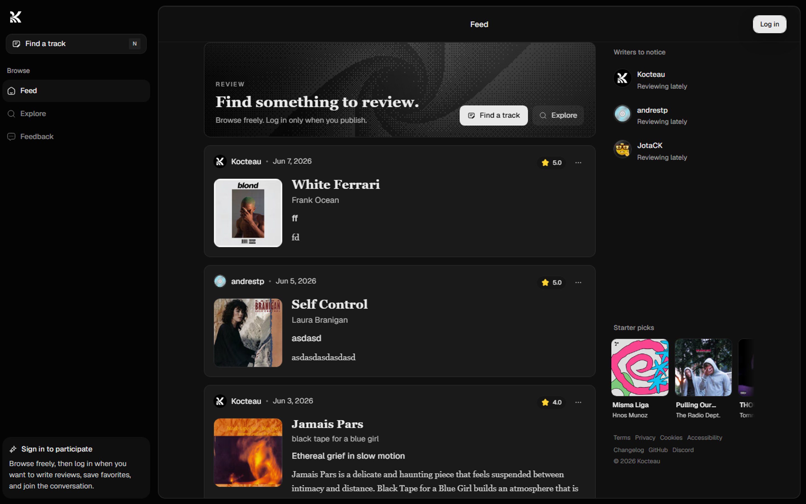

<p align="center">
  
</p>

<h1 align="center">Kocteau</h1>

<p align="center">
  Music reviews by real listeners. Human taste, quiet discovery, and editorial starter picks.
</p>

<p align="center">
  <a href="./LICENSE"></a>
  <a href="https://nextjs.org"></a>
  <a href="https://supabase.com"></a>
  
  <a href="https://github.com/francozeta/kocteau/graphs/contributors"></a>
  <a href="https://github.com/francozeta/kocteau/issues?q=is%3Aissue%20state%3Aopen%20label%3A%22good%20first%20issue%22"></a>
</p>

<p align="center">
  <a href="https://kocteau.com">Website</a>
  ·
  <a href="./CONTRIBUTING.md">Contributing</a>
  ·
  <a href="./docs/backlog.md">Backlog</a>
  ·
  <a href="https://github.com/francozeta/kocteau/issues?q=is%3Aissue%20state%3Aopen%20label%3A%22good%20first%20issue%22">Good first issues</a>
  ·
  <a href="./docs/README.md">Docs</a>
</p>

<p align="center">
  
</p>

Kocteau is an open-source music review and taste discovery app. The current product loop is simple: enter with email OTP, complete a profile, choose initial taste signals, review music, and discover new reviews through a personalized For You feed.

## Start Here

| Need | Read |
| --- | --- |
| Work on this repository | [AGENTS.md](./AGENTS.md), then [CURRENT.md](./CURRENT.md) |
| Understand the product and interface | [PRODUCT.md](./PRODUCT.md) and [DESIGN.md](./DESIGN.md) |
| Run or resume the project on another machine | [Local development](./docs/setup/local-development.md) |
| Find the code and data boundaries | [Architecture](./docs/core-architecture.md) |
| Contribute a focused change | [CONTRIBUTING.md](./CONTRIBUTING.md) and [backlog](./docs/backlog.md) |
| Find a technical or operational guide | [Documentation index](./docs/README.md) |

## Product And Stack

The web app includes email OTP, profile and taste onboarding, track reviews,
likes, bookmarks, comments, follows, a personalized For You feed, Search discovery,
and editorial starter picks. `/` is the public landing; signed-in listeners reach
For You at `/feed`. Curators research and manage picks in Studio through private
roles. [CURRENT.md](./CURRENT.md) distinguishes integrated behavior from review work
and remaining verification.

Next.js App Router, React, TypeScript, Tailwind/shadcn, TanStack Query, and Supabase
Auth/Postgres/Storage form the existing stack. Deezer supplies music identity;
MusicBrainz supports catalog research. See [architecture](./docs/core-architecture.md)
for the implementation map.

## Development

Use the Node version in [`.node-version`](./.node-version) and the pnpm version in
[`package.json`](./package.json). Contributors use Docker-backed local Supabase.

```bash
pnpm install --frozen-lockfile
```

Follow [local development](./docs/setup/local-development.md) to configure the
environment, initialize local data, and start `pnpm dev:web`. An existing checkout
should follow the returning-device steps before changing branches or resetting data.

```bash
pnpm check
git diff --check
```

`pnpm check` runs unit tests, workspace lint, and the web build with TypeScript
validation. Database and authenticated flows need their own verification.

## Contributing And Operations

Start with [good first issues](https://github.com/francozeta/kocteau/issues?q=is%3Aissue%20state%3Aopen%20label%3A%22good%20first%20issue%22),
[help wanted](https://github.com/francozeta/kocteau/issues?q=is%3Aissue%20state%3Aopen%20label%3A%22help%20wanted%22),
or the [backlog](./docs/backlog.md). Use conventional branches and commits as
defined in [AGENTS.md](./AGENTS.md). Release Please proposes versions and changelogs;
maintainers control publication and merge.

Environment variables belong to [the environment guide](./docs/security/environment.md).
Cloud migrations use [the Supabase workflow](./docs/maintainers/supabase-workflow.md);
rollout and smoke checks live in [operations](./docs/operations.md). Project skills
and their references travel with the clone through [.agents](./.agents/README.md).
